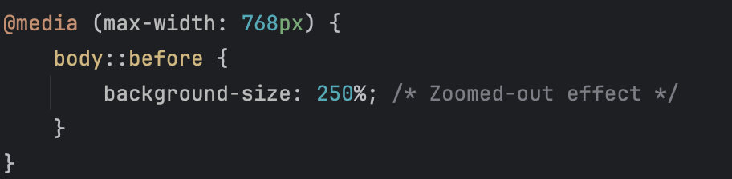

# ✨ MiracleDex Project Report

**Student Name:** John Clements  
**Course:** CSCI 270 – Web/Mobile App Development  
**Project Title:** MiracleDex  
**Submission Date:** 06/11/2025 
**GitHub Repo:** https://github.com/JClements123/MiracleDex 
**Live Site (GitHub Pages):** https://jclements123.github.io/MiracleDex/

---

Note: I used Google's AI overview to learn how to turn this document into a PDF.

## 🔷 Part 1 — HTML/CSS Layout and Responsive Design

### ✅ Requirements Addressed
- [ ] Landing page created with heading and container
- [ ] Used Flexbox or Grid layout
- [ ] Mobile-friendly design with media queries
- [ ] Elegant, reverent styling with a Google Font
- [ ] External CSS file used

### 📸 Screenshots

</img> 
Desktop layout of my MiracleDex website.

</img> 
Phone layout of my MiracleDex website.

### 🔍 Code Snippets
> Include relevant HTML and CSS snippets here (layout structure, responsive styling, etc.).

HTML Layout Structure:

</img> 
This screenshot demonstrates the overall layout of my app based on the HTML that I coded without the help of JavaScript.

   

CSS Responsive Design and Media Queries:

</img> 
A screenshot demonstrating my use of Grid in order to generate a responsive design.

   

</img> 

</img> 
The two screenshots above demonstrate my use of media queries in order to create both a desktop-friendly and 
mobile-friendly design. See CSS file for ChatGPT usage in media queries.   

### 🖋️ Reflection
What challenges did you face in designing a responsive layout? What did you learn about structuring HTML/CSS for real-world use?

Designing a responsive layout had easy aspects and more difficult aspects. It was very easy to implement the 
use of CSS Grid. There are only a few lines of CSS that you have to write to allow your cards to easily adapt
to the layout of your website and have everything feel very organize.

The biggest challenge for me was making sure that my mobile layout would look just as beautiful as the layout
for the computer. I ran into some challenges with this such as struggling with making sure that my media query
would do what I needed it to do. The image background for the phone was very blurry and would shift around a lot
when I loaded new cards, so I utilized ChatGPT to help me learn how to make my background just as clear as it was
on my computer. 

I found that structuring HTML for real-world use is actually very simple. You can set up a few divs here and there
to act as containers for all of your contents, and your HTML actually becomes very simple. When you are working with
the JavaScript DOM, you can generate a lot of your HTML through JavaScript and not have it hard-coded into your HTML file.
I actually wrote very little HTML for this project in my `index.html` file.

I found that structuring my CSS took a lot more work than building up the HTML. The CSS was where I ran into the most
problems with struggling to make my website beautiful and responsive. I found that there were so many things that you
have to take into account to let your website look good on several different layouts. I learned that you just have to 
keep testing and debugging as you write a lot of CSS to target each of the elements on your webpage.

---

## 🔷 Part 2 — JavaScript + DOM + JSON Integration

### ✅ Requirements Addressed
- [ ] Fetched data from:
  `https://gist.githubusercontent.com/trevortomesh/7bbf97b2fbae96639ebf1a254b6a7a70/raw/miracles.json`
- [ ] Rendered miracle title, location, year, summary
- [ ] Used `fetch()` and `async/await`
- [ ] Implemented "Load More" or pagination
- [ ] Added modal or expandable section with full miracle details

### 📸 Screenshots
> Show your miracle cards and one expanded view or modal.

</img> 
A screenshot showing my miracle cards.   

</img> 
A screenshot showing the modal for one of my miracle cards.

### 🔍 Code Snippets
> Include the function you used to fetch the data, render the cards, and handle interaction.

</img> 
Asynchronous function for fetching the data.   

</img> 
</img> 
</img> 
</img> 
</img> 
</img> 
</img> 
The above seven screenshots show the function that I used to display all of the miracle cards.   

### 🖋️ Reflection
What did you learn about asynchronous JavaScript? What debugging techniques did you use or discover?

I learned that using asynchronous JavaScript is actually very simple. My function that fetches all of the data
for my entire website is very simple. I call `await fetch()` and `await response.json()` in order to get all
of the information that I need to generate my miracle cards. The difficult part of the JavaScript was figuring
out how to update the Document Object Model with all of the information that I was retrieving from the JSON
file, but the easy part was getting that data. This assignment helped to reinforce what I had already learned
about the Fetch API and asynchronous JavaScript in the lectures.

One of the biggest debugging techniques that I utilized throughout this project was using ChatGPT when I was
particularly stuck on a problem that I was having. I would often try to solve the problem myself and to
spend some time with the problem before utilizing ChatGPT, but ChatGPT came in handy to solve problems that
I couldn't immediately sort out. 

I also tried to utilize `console.log()` as much as I could, as this helped me to make sure that I had actually
retrieved the data from the website. I utilized Chrome DevTools to see where my design was breaking and how
my website was coming along. Chrome DevTools is especially helpful for CSS problems, but it also can help you
see that updating the DOM changes the structure of your HTML. 

---

## 🔷 Part 3 — GitHub Repository and Documentation

### ✅ Requirements Addressed
- [ ] GitHub repo created and pushed
- [ ] GitHub Pages deployed
- [ ] `README.md` contains project description, instructions, and screenshots

### 📎 Links
- **GitHub Repo:** https://github.com/JClements123/MiracleDex
- **Live GitHub Pages Site:** https://jclements123.github.io/MiracleDex/

### 🖋️ Reflection
How did using GitHub affect your development process? What new Git or GitHub skills did you gain?

GitHub made my development process feel clean and organized. I could slowly update my GitHub repository as
I made changes throughout the project. This made me feel like I could keep track of the changes as I was making
them. Sometimes I would forget after having not worked on the project for a little while what changes I had made,
but I could go back and look at my commit history to check.

I learned how to utilize GitHub Pages to make my website go live for the public. I also continued to practice
and improve with using the git commands in my workflow. I sometimes made changes in WebStorm and committed and 
pushed there. I learned that when I made a new directory to store my screenshots, it didn't seem like I could
commit and push the new directory from WebStorm, so I went to the command line to use `git add .`.

---

## 🧠 Final Reflection

Imagine you're explaining this project to a friend who doesn’t code. What does your app do? What are you most proud of?
What was the hardest part to get working?

Reflect on both the technical and the spiritual aspects of building a project about Catholic miracles.

---

My app gets information from a separate file in order to create a tiled display of cards that teach the user
of the website about various miracles throughout history. The website displays a title and subtitle followed
by 6 miracle cards at the beginning. The user can click load more to load 6 more cards at a time while 
there is more data to generate new cards. When the user wants to learn more about a miracle, they can click
the Learn More button to read about the details, category, and type of the miracle. 

I am most proud of my design for this app. I really tried to generate a beautiful app that would provide a great space
for the user to learn more about the miracles. I was glad that I utilized AI to help me learn how to add an image as a 
background, because I thought it was very cool that I got to add a picture of Saint Peter's Basilica in the background.
I think that the website feels clean, uncluttered, and easy to use.

I believe that the hardest part of my website to get working was making it to have a responsive design. I was
having trouble with getting the media query to work, and I felt that while the design looked great on the computer,
the design was nowhere near as good on the phone. I believe that I was able to debug this well and make it so that
there is no sacrifice when the user utilizes their phone rather than their computer.

A lot of work clearly has to go into building a website. It likely took longer because I was just starting to 
learn how to build a website, but I spent several hours trying to get this website to look as good as possible. There
is a lot that goes into building a website even as relatively simple as this MiracleDex site. I believe that this project
provides me with the skills I need to start building larger, more complex websites. It was a blessing to get to learn
about the miracles as I was building this website. I especially liked learning about the Miracle of Buenos Aires which
was studied under Cardinal Bergoglio, as noted in the card. It's amazing that the host turned into a human heart.
It is great to use our technical skills to bear spiritual fruits, and I hope that anyone who sees our MiracleDex
websites will also benefit spiritually.
